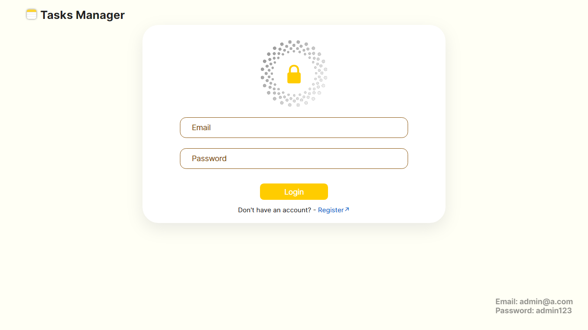
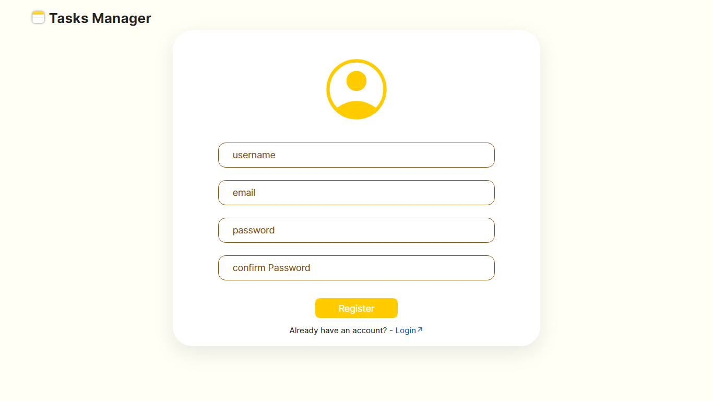
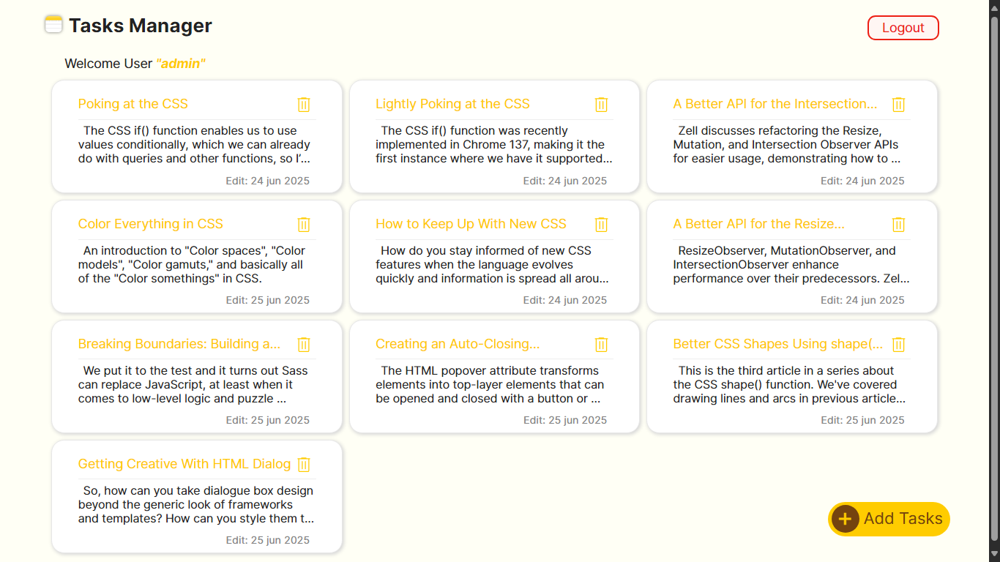
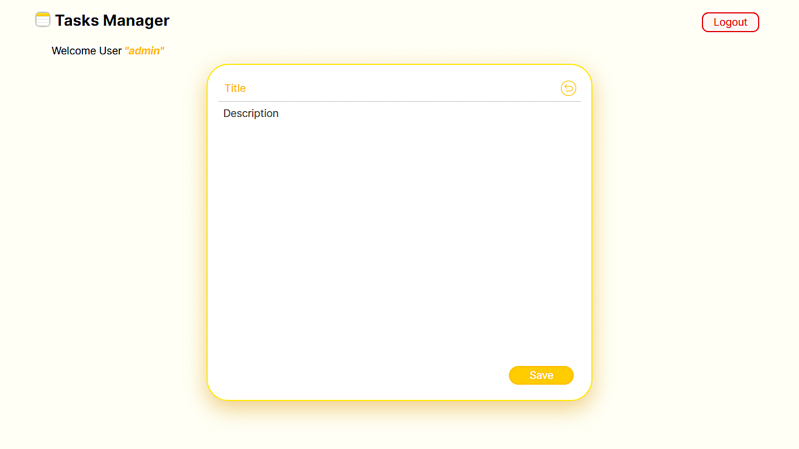

# 🗂️ MERN CRUD Auth

## 🧠 Task Manager con Autenticación

Este proyecto es una aplicación web desarrollada con **stack MERN,** enfocada en la **gestión personalizada de tareas**. Implementa funcionalidades de **registro e inicio de sesión de usuarios** mediante autenticación segura. Cada usuario accede a una **cuenta individual** desde la cual puede **crear, editar y eliminar sus propias tareas**, que se almacenan de forma **aislada en una base de datos MongoDB**.

## 🚀 Características

🔐 El sistema implementa **autenticación con JWT** y **gestión de sesiones mediante cookies**.  
📝 Una vez autenticado, el usuario puede **crear, leer, actualizar y eliminar tareas** (CRUD).  
🌐 Toda la información del usuario se almacena de forma segura en **MongoDB**, asociando las tareas con su cuenta personal.

---

## 🛠️ Tecnologías utilizadas

### 🔙 Backend

- **Express:** Framework web para Node.js
- **Mongoose:** ODM para MongoDB
- **bcryptjs:** Encriptación de contraseñas
- **jsonwebtoken:** Autenticación con tokens
- **cookie-parser:** Manejo de cookies
- **Zod:** Validación de datos

### 🔛 Frontend

- **React:** Biblioteca para construir interfaces de usuario
- **Axios:** Cliente HTTP para consumo de la API
- **js-cookie:** Manejo de cookies desde el navegador
- **React Hook Form:** Manejo eficiente de formularios
- **React Router DOM:** Navegación entre páginas

---

## 🧩 Funcionalidades

- Registro de nuevos usuarios con validación
- Inicio de sesión con persistencia de sesión (token en cookie)
- Logout seguro
- Gestión de tareas por usuario (CRUD)
- Validaciones tanto en frontend como backend

## 🔗 Endpoints

### 🛡️ Autenticación

| Método | Endpoint         | Descripción                             |
| ------ | ---------------- | --------------------------------------- |
| POST   | `/auth/register` | Registra un nuevo usuario               |
| POST   | `/auth/login`    | Inicia sesión y genera un token         |
| GET    | `/auth/verify`   | Verifica si el usuario está autenticado |
| POST   | `/auth/logout`   | Cierra sesión y elimina la cookie       |

### ✅ Tareas

| Método | Endpoint    | Descripción                          |
| ------ | ----------- | ------------------------------------ |
| GET    | `/tasks`    | Obtiene todas las tareas del usuario |
| GET    | `/task/:id` | Obtiene una tarea específica por ID  |
| POST   | `/task`     | Crea una nueva tarea                 |
| PUT    | `/task/:id` | Actualiza una tarea por ID           |
| DELETE | `/task/:id` | Elimina una tarea por ID             |

## 🖥️ Capturas de pantalla

| Login                                                          | Register                                                    |
| -------------------------------------------------------------- | ----------------------------------------------------------- |
|  |  |

| Tasks                                                    | Add Tasks                                              |
| -------------------------------------------------------- | ------------------------------------------------------ |
|  |  |
